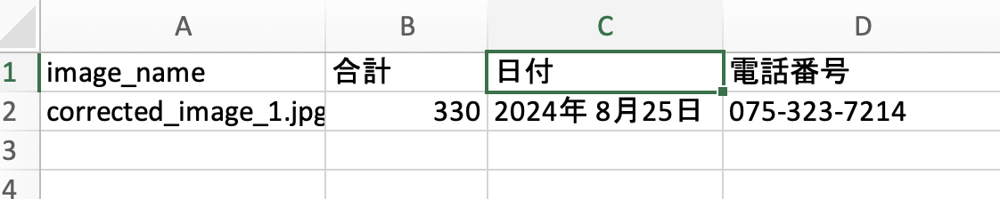

# 領収書の分類、検出とOCR認識のUIシステム

## Summary

この記事では、OCR認識UIシステムの構築プロセスについて詳しく紹介します。このシステムは、領収書画像から電話番号、日付、金額などの重要な情報を正確かつ効率的に抽出することができます。構築には、自分の作った[分類モデル](https://github.com/Forasimplelife/Receipt_classificaion_model)と[物体検出モデル](https://github.com/Forasimplelife/Receipt_detection_model)という2つのAIモデルを統合し、領収書の分類と情報を検出に行きますし。文字認識にはEasyOCRを採用し、検出した情報を認識に行きます。また、UIの構築にはStreamlitを使用しており、複雑なフロントエンドの開発知識を必要とせず、直感的でシンプルなUIシステムを手軽に制作できます。

 UIのデーザン

    

このUIシステムは領収書の写真をアップロードし、その後は角度の調整、物体検出とそしてOCR認識までを一連の流れで処理します。

    

##  システムの概要

本システムは以下のコンポーネントで構成されています：

1.	[分類モデル](https://github.com/Forasimplelife/Receipt_classificaion_model) (Classification Model)
    
    ResNetを基盤とした分類モデルを使用し、レシート画像の回転角度（0°, 90°, 180°, 270°）を判別します。その後、画像の角度を自動的0°に調整します。

2.	[物体検出モデル](https://github.com/Forasimplelife/Receipt_detection_model) (Detection Model)
    
    YOLOv9を基盤とした物体検出モデルを使用して、レシート内の重要情報が記載されている内容（電話番号、日時、金額など）を検出します。

3.	文字認識モデル (OCR)
    
    EasyOCRを使用して、検出された領域内のテキストを多言語対応で高精度に認識します。日本語と英語を含む複数言語に対応しています。

4.	UI (Streamlit)
    
    Streamlitを用いて、簡単かつ直感的に操作できるUIを提供します。

##  システムの操作の流れ

4つのステップで構成されています、画像の入力＞分類＞物体検出＞文字認識 (OCR)、具体的には以下に説明します。

1. 画像の入力
ユーザーがレシート画像をアップロードします。

    

2. 分類 (Classification)
ResNetベースの分類モデルが画像の回転角度を判定し、0°へ調整します。

    

	

    

	

3. 物体検出 (Object Detection)
YOLOv9を用いて、レシート内の重要ラベルを検出します。検出されたラベルははOCRモデルに渡されます。

    

	

    

	

4. 文字認識 (OCR)
EasyOCRが検出領域内の文字を認識し、結果をCSVダウンロードできます。

    

	

5. 結果の表示
抽出された情報（電話番号、日時、金額など）がCSVフィアルに表示されます。

    

	

## Reference

 <b>Expand</b> 

* [https://github.com/AlexeyAB/darknet](https://github.com/AlexeyAB/darknet)
* [https://github.com/WongKinYiu/yolov9](https://github.com/WongKinYiu/yolov9)
* [https://github.com/VDIGPKU/DynamicDet](https://github.com/VDIGPKU/DynamicDet)
* [https://github.com/DingXiaoH/RepVGG](https://github.com/DingXiaoH/RepVGG)
