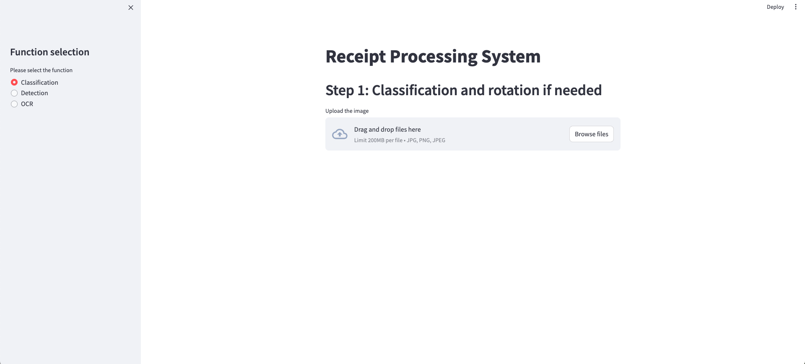

# 領収書の分類、認識とOCRのUIシステム

## Summary

この記事では、OCR認識UIシステムの構築プロセスについて詳しく紹介します。このシステムは、領収書画像から電話番号、日時、金額などの重要な情報を正確かつ効率的に抽出することができます。構築には、[分類モデル](https://github.com/Forasimplelife/Receipt_classificaion_model)と物体検出モデルという2つのAIモデルを統合し、領収書内の情報を効果的に解析しています。文字認識には高精度なEasyOCRを採用し、データの抽出精度をさらに向上させました。また、UIの構築にはStreamlitを使用しており、シンプルで直感的な操作を可能にする画面を実現しました

この UIシステムは領収書の写真をアップロードし、その後は角度の調整、物体検出とOCR認識を一貫で行なっています。

    

##  システムの概要

本システムは以下のコンポーネントで構成されています：
	1.	分類モデル (Classification Model)
ResNetを基盤とした分類モデルを使用し、レシート画像の回転角度（0°, 90°, 180°, 270°）を判別します。このステップにより、画像の向きを統一し、後続の処理を最適化します。
	2.	物体検出モデル (Detection Model)
YOLOv9を基盤とした物体検出モデルを使用して、レシート内の重要情報が記載されている領域（店舗名、日時、金額など）を検出します。これにより、特定の領域を効率よく抽出します。
	3.	文字認識モデル (OCR)
EasyOCRを使用して、検出された領域内のテキストを多言語対応で高精度に認識します。日本語と英語を含む複数言語に対応しています。
	4.	UI (Streamlit)
Streamlitを用いて、簡単かつ直感的に操作できるユーザーインターフェースを提供します。専門知識がなくても利用可能です。

##  システムの構造と運用フロー

1. 画像の入力
ユーザーがレシート画像をアップロードします。

    

2. 分類 (Classification)
ResNetベースの分類モデルが画像の回転角度を判定し、適切な方向に調整します。

    

	

    

	

3. 物体検出 (Object Detection)
YOLOv9を用いて、レシート内の重要領域を検出します。検出された領域はOCRモデルに渡されます。

    

	

    

	

4. 文字認識 (OCR)
EasyOCRが検出領域内の文字を認識し、結果をテキスト形式で出力します。

    

	

5. 結果の表示
抽出された情報（店舗名、日時、金額など）がStreamlitのUIに表示されます。

    

	

## Reference

 <b>Expand</b> 

* [https://github.com/AlexeyAB/darknet](https://github.com/AlexeyAB/darknet)
* [https://github.com/WongKinYiu/yolov9](https://github.com/WongKinYiu/yolov9)
* [https://github.com/VDIGPKU/DynamicDet](https://github.com/VDIGPKU/DynamicDet)
* [https://github.com/DingXiaoH/RepVGG](https://github.com/DingXiaoH/RepVGG)
